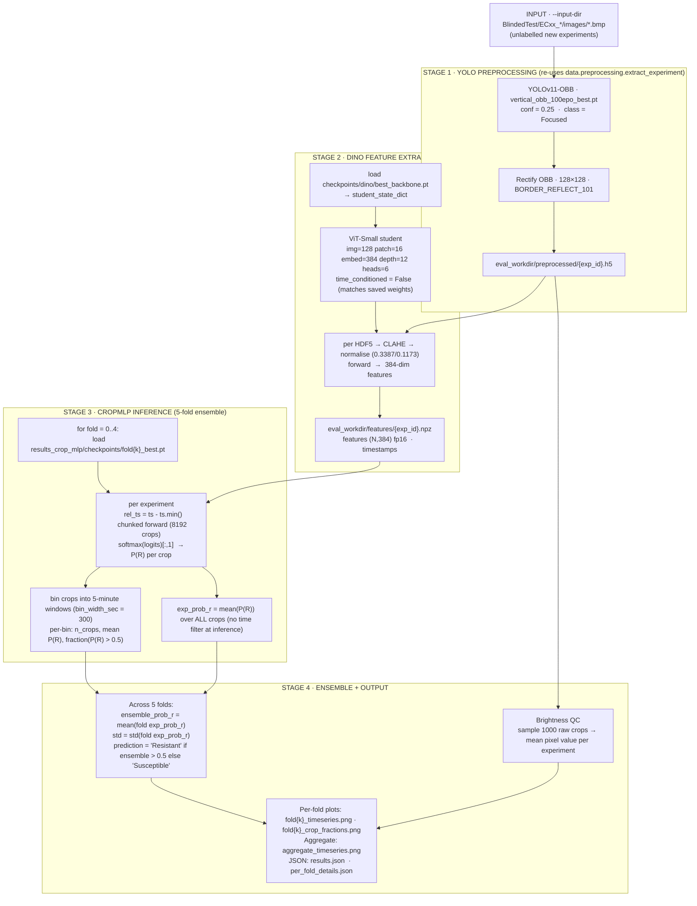

# CropMLP Pipeline Diagrams

Only the `results_crop_mlp` path is documented here — the other classifiers
(`results_strain_holdout*`, `results_v2`, etc.) are not used.

Sources fact-checked against:
- `train_dino_correctly.py` (commit 6221408)
- `scripts/eval_new_experiments.py` (commit 03a876a)
- `scripts/strain_holdout_crop_classifier.py` (commit e426d9c)
- `data/preprocessing.py`, `training/train_dino.py`,
  `training/extract_features.py`, `models/backbone.py`

---

## 1. Training Pipeline

```mermaid
flowchart TD
    subgraph RAW ["RAW DATA — /mnt/f/Data_second_protocol/"]
        R1[Resistant/ECxx_*/images/*.bmp — 11 experiments]
        R2[Susceptible/ECxx_*/images/*.bmp — 16 experiments]
        R3[Test/ECxx_*/images/*.bmp — 15 experiments]
        R4["image_{unix_ts.ms}.bmp  @  5 FPS, ~14.5k frames/experiment<br/>1024x1024  8-bit grayscale  100x brightfield"]
        R1 --- R4
        R2 --- R4
        R3 --- R4
    end

    subgraph S1 ["STAGE 1 · YOLO PREPROCESSING  (data/preprocessing.py)"]
        P1["YOLOv11-OBB — vertical_obb_100epo_best.pt<br/>(DOTAv1 pretrained + 100-epoch finetune)"]
        P2["conf_threshold = 0.25<br/>keep class 0 = Focused  (drop Unfocused, Vertical)"]
        P3["_rectify_obb_crop: affine warp the OBB upright<br/>crop_size = 128×128,  border_mode = BORDER_REFLECT_101"]
        P4["HDF5 per experiment · preprocessed/{exp_id}.h5<br/>crops  (N,128,128) uint8<br/>metadata  {timestamp, cx,cy,w,h, angle, confidence}"]
        P1 --> P2 --> P3 --> P4
    end

    subgraph S2 ["STAGE 2 · DINO SELF-SUPERVISED PRETRAINING  (train_dino_correctly.py → training/train_dino.py)"]
        D0["DINOCropDataset<br/>max_crops_per_experiment = 5000  →  ~207K crops total"]
        D1["DINOMicroscopyAugmentation (per crop)<br/>1. CLAHE (clipLimit=2.0, tile=8×8)<br/>2. Normalise  mean=0.3387  std=0.1173<br/>3. Multi-crop:<br/>     2 global @ 128×128  scale (0.7, 1.0)<br/>     6 local  @ 64×64    scale (0.3, 0.6)<br/>4. brightness=0.03  contrast=0.3  noise≤0.01  defocus≤3"]
        D2["Student ViT-Small — 1-channel input<br/>img=128  patch=16  embed=384  depth=12  heads=6<br/>time_conditioned = FALSE  (verified: no time_proj weights in best_backbone.pt)"]
        D3["DINO Head · 2048 hidden → 256 bottleneck → 4096 prototypes<br/>(4096 — NOT 65536; larger collapses on this dataset)"]
        D4["EMA Teacher (same arch)<br/>momentum 0.996 → 1.0"]
        D5["DINOLoss<br/>teacher_temp 0.04 → 0.07 (30-ep warmup)<br/>student_temp 0.1  ·  center_momentum 0.9"]
        D6["AdamW  lr 5e-4 → 1e-6  (cosine, 10-ep warmup)<br/>wd 0.04 → 0.4  ·  batch 64  ·  100 epochs  ·  grad_clip 3.0"]
        D7["checkpoints/dino/best_backbone.pt<br/>best student loss = 0.815 @ epoch 43"]
        D0 --> D1 --> D2 --> D3 --> D5
        D2 -.EMA.-> D4 --> D5
        D5 --> D6 --> D7
    end

    subgraph S3 ["STAGE 3 · FEATURE EXTRACTION  (training/extract_features.py)"]
        F1["Load best_backbone.pt → ViT-Small student (eval)"]
        F2["HDF5InferenceDataset per experiment<br/>CLAHE → /255 → normalise (0.3387 / 0.1173)"]
        F3["Forward pass (AMP, fp16)<br/>backbone(crop)  →  384-dim CLS<br/>(time arg is ignored — backbone not time-conditioned)"]
        F4["features/{exp_id}.npz<br/>features (N,384) fp16  ·  timestamps (N,) float64<br/>42 files  ·  2.38M crops total"]
        F1 --> F3
        F2 --> F3 --> F4
    end

    subgraph S4 ["STAGE 4 · CROPMLP TRAINING  (scripts/strain_holdout_crop_classifier.py)"]
        C0["build_strain_grouped_experiments (Resistant+Susceptible+Test)<br/>generate_folds: 5 folds, hold out 2 R-strains + 2 S-strains each"]
        C1["Per fold — load features/{exp_id}.npz<br/>★ KEEP ONLY CROPS WITH rel_ts ≥ 2400 s (40 min) ★<br/>max 10,000 crops per experiment<br/>val: 1 experiment per non-holdout strain"]
        C2["CropMLP<br/>Linear 384→128 · LN · GELU · Drop(0.3)<br/>Linear 128→64  · LN · GELU · Drop(0.3)<br/>Linear 64→2"]
        C3["CE loss with class weights = N / (2·n_c)<br/>AdamW lr 1e-3  wd 0.01  ·  100 epochs  ·  batch 2048<br/>5-ep warmup → cosine · grad_clip 1.0<br/>early stop on val AUC · patience 15"]
        C4["results_crop_mlp/checkpoints/<br/>fold0_best.pt … fold4_best.pt"]
        C0 --> C1 --> C2 --> C3 --> C4
    end

    RAW --> S1
    P4 --> D0
    P4 --> F2
    D7 --> F1
    F4 --> C1
```

---

## 2. Evaluation Pipeline

---

## Key invariants (must match between train and eval)

| Parameter | Value | Location |
|---|---|---|
| Crop size | 128 × 128 | `train_dino_correctly.py:109`, `eval_new_experiments.py:50` |
| Border mode | `cv2.BORDER_REFLECT_101` | `eval_new_experiments.py:51` |
| YOLO conf | 0.25 | both |
| DINO input size | 128 | both |
| CLAHE | clipLimit=2.0, tile=(8,8) | `extract_features.py:27` |
| Normalisation | mean=0.3387, std=0.1173 | both |
| Eval bin width | 300 s (5 min) | `eval_new_experiments.py:194` |
| MLP training time filter | rel_ts ≥ 2400 s (40 min) | `strain_holdout_crop_classifier.py:721` |
| MLP training cap | 10,000 crops / experiment | `strain_holdout_crop_classifier.py:725` |

## Note on time conditioning (v1 backbone)

`train_dino_correctly.py:59` sets `cfg.time_conditioned = True` and the
`DINOConfig` pickled inside `checkpoints/dino/best_backbone.pt`
reflects that. However the saved `student_state_dict` contains only
`{blocks, cls_token, norm, patch_embed, pos_embed}` — there are no
`time_proj` weights. So the production v1 backbone (128×128,
head_output_dim=4096, best loss 0.815 @ epoch 43) was actually trained
**without** time conditioning; the `True` flag in the saved config is
misleading. `eval_new_experiments.py:156` loading with
`time_conditioned=False` matches what was saved — feature extraction at
eval is identical to what the CropMLP was trained against.
