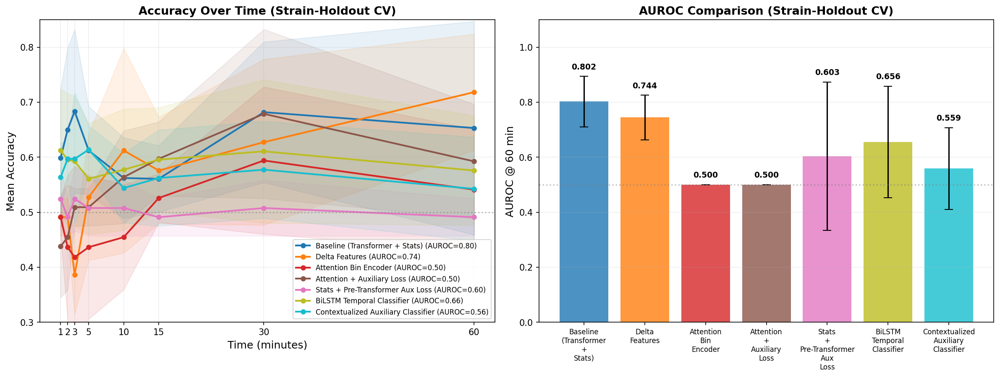
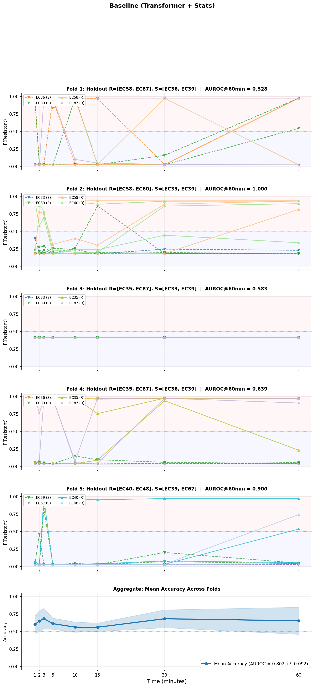

# Rapid Antimicrobial Susceptibility Testing via Deep Learning on Time-Lapse Microscopy

## Table of Contents

1. [Introduction and Motivation](#1-introduction-and-motivation)
2. [The Problem: Why This Is Hard](#2-the-problem-why-this-is-hard)
3. [Data](#3-data)
4. [Pipeline Overview](#4-pipeline-overview)
5. [Stage 1: Bacteria Detection (YOLO)](#5-stage-1-bacteria-detection-yolo)
6. [Stage 2: Self-Supervised Feature Learning (DINO)](#6-stage-2-self-supervised-feature-learning-dino)
7. [Stage 3: Feature Extraction](#7-stage-3-feature-extraction)
8. [Stage 4: Temporal Classification](#8-stage-4-temporal-classification)
9. [Experiments and Results](#9-experiments-and-results)
10. [Discussion](#10-discussion)
11. [Key Lessons Learned](#11-key-lessons-learned)

---

## 1. Introduction and Motivation

When a patient has a bacterial infection, doctors prescribe antibiotics. But not all antibiotics work against all bacteria -- some bacteria have evolved **resistance** to certain drugs. Knowing whether a specific bacterial sample is **resistant** or **susceptible** (i.e., can be killed by) a given antibiotic is critical for choosing the right treatment.

The standard method for testing this -- called an **Antimicrobial Susceptibility Test (AST)** -- involves growing bacteria on plates with antibiotics and waiting 16-24 hours to see if they grow or die. This is too slow. Patients may receive the wrong antibiotic for a full day before results come back, leading to worse outcomes and contributing to the broader crisis of antibiotic resistance.

This project attempts to classify bacteria as resistant or susceptible **within minutes** rather than hours, by analyzing time-lapse microscopy video of *E. coli* bacteria exposed to antibiotics.

### The Core Idea

When susceptible bacteria are exposed to an effective antibiotic, their morphology (shape and appearance) changes over time: they may elongate, swell, lyse (burst), or stop dividing. Resistant bacteria continue to look normal and divide. If we can detect these subtle visual changes in a population of bacteria under a microscope, we can predict the outcome long before it would be visible on a traditional culture plate.

---

## 2. The Problem: Why This Is Hard

### Why Not Just Track Individual Bacteria?

The intuitive approach would be to follow a single bacterium over time and watch it change. However, this is impossible with our imaging setup:

- **Frame rate**: 5 frames per second at 100x magnification
- **Flow**: The sample is in a microfluidic channel with flowing media. Bacteria move too quickly between frames for any tracking algorithm (such as intersection-over-union matching) to reliably link detections across frames.
- **Visibility window**: A typical bacterium is visible for only ~2 seconds (~10 frames) before it flows out of view. This is far too short to observe meaningful morphological changes in individual cells.

### The Population-Level Insight

Instead of tracking individuals, we observe **populations**. At any given time point, we can see hundreds of bacteria in the field of view. While we can't follow any single one, we can characterize the *statistical distribution* of the population's appearance. The hypothesis is:

> The population-level distribution of bacterial morphology shifts differently over time for resistant vs. susceptible populations, and this shift is detectable from the feature statistics.

This reframes the problem from a tracking task to a **time-series classification** task over population snapshots.

### Small Dataset Challenge

We have only **42 experiments** total across 15 bacterial strains (7 resistant, 8 susceptible), with 2-3 experiments per strain. While each experiment contains hundreds of thousands of individual bacteria images (2.38 million crops total), for supervised classification the effective sample size is just 42 -- the number of independent experiments with known labels. Training deep neural networks with ~42 labeled samples is a fundamental challenge throughout this work.

---

## 3. Data

### Experimental Setup

- **Organism**: *Escherichia coli* (*E. coli*)
- **Antibiotic**: Ampicillin
- **Imaging**: Brightfield microscopy at 100x magnification, 5 FPS, grayscale
- **Duration**: 1 hour per experiment (~18,000 frames)
- **Image size**: 1024x1024 pixels per frame
- **Naming convention**: `EC{strain_number}_{Antibiotic}_{dose}_{details}` (e.g., `EC35_Ampicillin_16mgL_preincubated_2_TEM40`)

### Dataset Split

| Category      | Strains | Experiments | Description |
|--------------|---------|-------------|-------------|
| Resistant    | 7 (EC35, EC40, EC48, EC58, EC60, EC65, EC87) | 19 | Known to survive ampicillin |
| Susceptible  | 8 (EC33, EC36, EC39, EC42, EC67, EC79, EC89, EC126) | 23 | Known to be killed by ampicillin |
| **Total**    | **15**  | **42**      | |

Each experiment is stored as an HDF5 file containing pre-extracted 128x128 grayscale bacteria crops with timestamps.

### Data Scale

| Metric | Value |
|--------|-------|
| Total bacteria crops | 2.38 million |
| Crop dimensions | 128x128 pixels, uint8 grayscale |
| Raw pixel statistics | mean=57, std=10 (on 0-255 scale) |
| Post-CLAHE statistics | mean=87, std=28 |
| Crops per experiment | 30,000 - 80,000+ |

Note the extremely narrow dynamic range of the raw images (pixel values concentrated in the 40-85 range on a 0-255 scale). This is a common challenge with brightfield microscopy and was a source of training difficulties, discussed in Section 6.

---

## 4. Pipeline Overview

The system is a multi-stage pipeline. Each stage builds on the previous one:

```
Raw microscopy frames
        |
        v
[Stage 1] YOLO Object Detection
        |  Detect bacteria, extract focused crops
        v
128x128 grayscale crops with timestamps (HDF5)
        |
        v
[Stage 2] DINO Self-Supervised Learning
        |  Learn visual representations without labels
        v
Pretrained ViT backbone
        |
        v
[Stage 3] Feature Extraction
        |  Convert every crop to a 384-dim feature vector
        v
Per-experiment feature files (NPZ)
        |
        v
[Stage 4] Temporal Classification
        |  Bin by time -> Population stats -> Temporal model -> R/S prediction
        v
Resistant / Susceptible prediction (with confidence over time)
```

The key design choice is separating **representation learning** (Stages 1-2, unsupervised) from **classification** (Stages 3-4, supervised). This matters because we have millions of crops for learning good visual features, but only 42 labeled experiments for learning to classify. By learning features in an unsupervised way first, we extract maximum value from the unlabeled data.

---

## 5. Stage 1: Bacteria Detection (YOLO)

### What Is Object Detection?

Object detection is the task of finding objects in an image and drawing bounding boxes around them. Unlike image classification (which says "this image contains a cat"), object detection says "there is a cat at these coordinates."

### YOLO (You Only Look Once)

We use **YOLOv11** with oriented bounding boxes (OBB), which can detect objects at arbitrary angles -- important because bacteria can be at any orientation. The model was trained separately on annotated microscopy data.

### Detection Classes

The YOLO model recognizes three categories:
1. **Focused** -- bacteria that are in-focus and clearly visible
2. **Unfocused** -- bacteria that are blurry (out of the focal plane)
3. **Vertical** -- bacteria oriented vertically (end-on to the camera)

**We only keep "Focused" detections.** Unfocused and vertical bacteria provide unreliable morphological information and would add noise to downstream analysis.

### Crop Extraction

For each focused detection:
1. The oriented bounding box is rectified (rotated to axis-aligned) via an affine transform
2. The crop is resized to 128x128 pixels
3. The timestamp is recorded from the image filename (unix timestamp in milliseconds)
4. All crops are saved to a per-experiment HDF5 file

---

## 6. Stage 2: Self-Supervised Feature Learning (DINO)

### The Representation Problem

Our bacteria crops are 128x128 grayscale images. We need to convert each crop into a compact numerical representation (a "feature vector") that captures its morphological properties. We could use the raw pixel values, but that would be extremely high-dimensional (16,384 values per crop) and wouldn't capture semantic content well.

### What Is Self-Supervised Learning?

**Supervised learning** requires labeled data: "this image is a cat, this image is a dog." **Self-supervised learning** creates its own learning signal from the data structure itself, requiring no labels. This is crucial for us because we have 2.38 million crops but no per-crop labels (we only know the experiment-level R/S label, not whether an individual bacterium "looks resistant").

### DINO (Self-Distillation with No Labels)

DINO is a self-supervised method developed by Caron et al. (2021) at Meta AI. The key idea:

1. Take one image and create two different augmented versions of it (different crops, rotations, color jitter, etc.)
2. Feed both versions through two copies of the same network: a **student** and a **teacher**
3. Train the student to produce the same output as the teacher
4. The teacher is not trained by gradient descent -- instead, it's a slowly-updating average of the student (called an Exponential Moving Average or EMA)

This forces the network to learn features that are **invariant to augmentations** -- it must recognize that a rotated, slightly brightened version of a bacterium is still the "same thing." The resulting features capture the intrinsic visual properties rather than surface-level pixel patterns.

### Architecture: Vision Transformer (ViT-Small)

The backbone network is a **Vision Transformer (ViT)**. Here's how it works, step by step:

#### What Is a Transformer?

A Transformer is a type of neural network originally designed for language processing (translating text, for example). Its key innovation is the **attention mechanism**: the ability to look at all parts of the input simultaneously and learn which parts are relevant to which other parts, regardless of their position. This is in contrast to older architectures like CNNs (Convolutional Neural Networks) that only look at local neighborhoods.

#### How ViT Applies Transformers to Images

Images aren't sequences of words, so ViT converts them into a sequence:

1. **Patch embedding**: The 128x128 image is divided into a grid of 16x16 pixel patches, producing 8x8 = 64 patches. Each patch is projected to a 384-dimensional vector via a learned linear projection (implemented as a convolution).

2. **CLS token**: A special learnable token is prepended to the sequence. After processing, this token's output serves as the representation of the entire image.

3. **Positional embeddings**: Since the Transformer itself doesn't know where patches came from spatially, learnable position vectors are added to each patch embedding to encode spatial location.

4. **Transformer blocks (x12)**: The sequence of 65 tokens (1 CLS + 64 patches) passes through 12 successive Transformer blocks. Each block contains:
   - **Multi-Head Self-Attention (MHSA)**: Every token computes attention scores with every other token, learning which patches are relevant to each other. With 6 attention heads, the model can attend to different relationships simultaneously.
   - **Feed-Forward Network (FFN)**: A two-layer MLP that processes each token independently.
   - **Layer Normalization**: Stabilizes training by normalizing activations.
   - **Residual connections**: The input to each sub-layer is added to its output, making it easier to train deep networks.
   - **Stochastic depth**: During training, entire blocks are randomly skipped with increasing probability (0% for the first block, up to 10% for the last). This regularization prevents overfitting.

5. **Output**: The final CLS token is a 384-dimensional vector that represents the entire image.

#### ViT-Small Configuration

| Parameter | Value | Description |
|-----------|-------|-------------|
| Image size | 128x128 | Grayscale microscopy crops |
| Patch size | 16x16 | 64 patches per image |
| Embedding dimension | 384 | Size of feature vectors |
| Depth | 12 | Number of Transformer blocks |
| Attention heads | 6 | Parallel attention computations per block |
| MLP ratio | 4.0 | Hidden layer is 4x the embedding dim (1536) |
| Drop path rate | 0.1 | Max stochastic depth probability |

### DINO Training Details

#### Multi-Crop Strategy

Each training image produces multiple augmented views:
- **2 global crops** (128x128, scale 70-100%): Large views that see most of the bacterium
- **6 local crops** (64x64, scale 30-60%): Smaller views focusing on local details

The teacher only processes global crops; the student processes all 8 views. This teaches the model that local details should be consistent with the global structure.

#### Microscopy-Specific Augmentations

Standard computer vision augmentations (like changing an image from a forest scene to look red-tinted) can be too aggressive for microscopy. Our augmentations are carefully calibrated:

- **CLAHE** (Contrast-Limited Adaptive Histogram Equalization): Applied first to expand the narrow dynamic range. This preprocessing step converts the raw mean=57/std=10 distribution to mean=87/std=28, making subtle morphological features more visible.
- **Brightness jitter**: +/-3% (deliberately small -- the data's dynamic range is only 0.145 in normalized units, so ImageNet-style 30% jitter would destroy the signal)
- **Contrast jitter**: +/-30%
- **Gaussian noise**: std up to 0.01
- **Defocus blur**: Radius 0-3 pixels (simulates slight focus variation)
- **Random rotation**: +/-180 degrees (bacteria can be at any orientation)
- **Random flips**: Horizontal and vertical

#### Training Configuration

| Parameter | Value |
|-----------|-------|
| Optimizer | AdamW |
| Base learning rate | 5e-4 (scaled by batch_size/256) |
| Warmup epochs | 10 |
| Weight decay | 0.04 -> 0.4 (cosine schedule) |
| EMA momentum | 0.996 -> 1.0 (cosine schedule) |
| Teacher temperature | 0.04 -> 0.07 (warmup over 30 epochs) |
| Student temperature | 0.1 |
| Projection head output dim | 4096 |
| Max crops per experiment | 5,000 (balanced sampling) |
| Effective dataset size | ~207,000 crops |
| Batch size | 64 |

#### Mode Collapse and Fix

The first DINO training run suffered **mode collapse** -- a failure mode where the network learns to produce identical outputs for all inputs, making it useless. The loss plateaued at ln(4096) = 8.32 from epoch 2 onward.

**Root causes identified:**
1. **Wrong normalization**: We initially used ImageNet defaults (mean=0.5, std=0.25), but our data has mean=0.225, std=0.049 (in 0-1 scale). This compressed all input values into a tiny range, destroying variation.
2. **Too-aggressive augmentation**: Brightness jitter of +/-0.3 was ~4x the data's actual dynamic range, making augmented views unrecognizable.
3. **Too many prototypes**: 65,536 output dimensions for ~207K training samples left most dimensions unused.

**Fixes:**
- Added CLAHE as a preprocessing step to expand the dynamic range
- Computed correct normalization statistics on post-CLAHE data (mean=0.3387, std=0.1173)
- Reduced brightness jitter from 0.3 to 0.03
- Reduced projection head output from 65,536 to 4,096

After these fixes, a 5-epoch trial showed healthy learning: loss dropped from 8.44 to 4.56 across epochs, confirming the model was actively learning useful representations.

---

## 7. Stage 3: Feature Extraction

Once DINO training is complete, we extract features for every bacteria crop across all experiments:

1. Load the trained ViT backbone (student weights)
2. For each experiment's HDF5 file:
   - Load crops in batches of 512
   - Apply CLAHE + normalization (matching the DINO training pipeline)
   - Forward pass through the backbone
   - Collect the CLS token output (384-dimensional vector per crop)
3. Save as NPZ files: `features` array (N x 384, float16) + `timestamps` array

The result: each bacterium crop is now represented as a 384-dimensional feature vector that captures its morphological properties, learned entirely without manual labels.

---

## 8. Stage 4: Temporal Classification

This is where the supervised classification happens. The goal: given the population's feature evolution over time, predict whether the experiment is resistant or susceptible.

### 8.1 Data Representation: Time Binning

Each experiment has thousands of crops spread over 1 hour. We organize them into **time bins**:

- **Bin width**: 120 seconds (2 minutes)
- **Max crops per bin**: 256 (randomly sampled if more are available)
- A 1-hour experiment produces up to 30 time bins

Each time bin is essentially a "population snapshot" -- the set of bacteria features visible at that time point. The model's input for one experiment is a 3D tensor of shape `(T, 256, 384)` where T is the number of bins, 256 is the max crops per bin, and 384 is the feature dimension.

### 8.2 Time Window Sampling

During training, we don't always use the full 1-hour experiment. Instead, each experiment is sampled at different time windows (e.g., first 1 minute, first 5 minutes, first 15 minutes, etc.). This:
- Creates more training samples from limited data (8 different windows per experiment per epoch)
- Forces the model to make predictions at any point during the experiment, not just at the end
- Enables **early exit**: the ability to stop observing early if the model is already confident

Time windows are sampled from [60s, 120s, 180s, 300s, 600s, 900s, 1800s, 3600s] with weights favoring shorter windows (0.20, 0.20, 0.15, 0.15, 0.10, 0.10, 0.05, 0.05), since we want the model to learn to classify quickly.

### 8.3 Model Architectures

We experimented with multiple architectures. All share the same bin encoder (first stage) but differ in how they process the temporal sequence.

#### Population Bin Encoder

This is the first stage, shared across all models. It compresses each bin's population of 256 crop features into a single vector:

**Statistics-based encoder** (PopulationBinEncoder):
For each of the 384 feature dimensions, compute four statistics across the crops in the bin:
1. **Mean**: The average value -- captures the "typical" bacterium's appearance
2. **Standard deviation**: The spread -- captures population heterogeneity
3. **Skewness**: The asymmetry of the distribution -- captures whether there's a "tail" of unusual morphologies
4. **Kurtosis**: The "peakedness" -- captures whether the population is uniform or has outliers

This produces a 4 x 384 = 1,536-dimensional summary plus a normalized crop count, which is projected through a small MLP to a 128-dimensional bin embedding.

The statistics-based approach is a deliberate choice: with only ~25 training experiments per cross-validation fold, a fixed mathematical summary is more reliable than a learned one (see the attention encoder experiment in Section 9).

**Attention-based encoder** (AttentionBinEncoder -- experimental):
Instead of fixed statistics, uses a learned cross-attention mechanism with a query token to pool over crops. The query "asks" the crop features what's important and aggregates them via attention weights. This is theoretically more flexible but requires more data to train.

#### Architecture A: Transformer Temporal Classifier (Baseline)

`PopulationTemporalClassifier` -- the primary architecture.

```
Input: T time bins, each with up to 256 crops of dimension 384

[Bin Encoder]
  For each bin: compute mean/std/skew/kurtosis over crops
  Project to 128-dim bin embedding
  -> (T, 128) sequence of bin embeddings

[Auxiliary Bin Classifier]
  For each bin: predict R/S from (bin_embedding, normalized_time)
  Small MLP: (128+1) -> 64 -> 2
  Provides per-bin training signal

[Temporal Encoder]
  Add continuous time positional encoding (sinusoidal, based on actual timestamps)
  4-layer Transformer encoder
  -> (T, 128) contextualized bin embeddings

[Gated Attention Pooling]
  Learn attention weights over time bins
  Weighted sum -> single 128-dim experiment representation

[Classification Head]
  Concatenate with time_fraction (how far into the experiment we are)
  MLP: (128+1) -> 64 -> 64 -> 2
  Output: [susceptible_logit, resistant_logit]
```

**Key component: Gated Attention MIL**

The Gated Attention mechanism (from Ilse et al., 2018, originally designed for Multiple Instance Learning in computational pathology) learns which time bins are most informative for the final prediction. For each bin's representation h_i:

```
V_i = tanh(W_1 @ h_i)       -- "what information is here?"
U_i = sigmoid(W_2 @ h_i)    -- "is this information relevant?"
a_i = softmax(W_3 @ (V_i * U_i))  -- attention weight
```

The gating (U_i) allows the model to suppress bins that contain information but are not relevant to the classification task. This is important because early bins should be largely ignored (both classes look the same), while late bins should receive high attention.

**Key component: Time-Aware Loss**

Standard classification loss treats all predictions equally. Our **TimeAwareLoss** weights correct early predictions more highly:

```
weight = 1 + alpha * (1 - t / T_max)
```

where alpha=2.0. An experiment correctly classified at 1 minute contributes 3x more to the loss than one classified at 60 minutes. This incentivizes the model to develop early prediction capability.

#### Architecture B: BiLSTM Temporal Classifier

`LSTMTemporalClassifier` -- an alternative temporal processing approach.

```
[Bin Encoder] -- same as baseline

[BiLSTM]
  2-layer bidirectional LSTM
  Processes bin embeddings as a sequence
  -> (T, 256) per-timestep hidden states (128 forward + 128 backward)

[Per-Timestep Classifier]
  At each time step: predict R/S from (lstm_hidden, normalized_time)
  MLP: (256+1) -> 64 -> 2

Output: Per-timestep predictions + final prediction (from last valid bin)
```

**How LSTMs Differ from Transformers:**

An **LSTM** (Long Short-Term Memory) processes sequences step by step, maintaining a "memory cell" that selectively retains or forgets information. A **Transformer** processes the entire sequence at once via attention, allowing any position to attend to any other position.

The LSTM was tested because its sequential nature might better capture the *direction* of temporal changes (a monotonic drift in one direction), while the Transformer's global attention might struggle with such gradual signals over short sequences.

The BiLSTM (bidirectional) runs both forward and backward over the sequence, giving each time step context from both past and future bins.

#### Architecture C: Contextualized Auxiliary Classifier

`ContextualAuxClassifier` -- a variant of the baseline designed to improve the auxiliary loss signal.

The key difference is **where the auxiliary predictions happen**:

- **Baseline**: Auxiliary R/S predictions on each bin **before** the Transformer (each bin is classified in isolation)
- **Contextualized variant**: Auxiliary predictions **after** the Transformer (each bin's prediction is informed by the full temporal sequence)

**Why this matters:** In the baseline, the auxiliary classifier must predict R/S from a single time bin without temporal context. At early time points, this is nearly impossible because resistant and susceptible bacteria look identical. In the contextualized variant, even the prediction for an early bin can leverage information from later bins (thanks to the Transformer's bidirectional attention), making the auxiliary signal more useful.

Additionally, this variant uses a **time-weighted auxiliary loss**:

```python
weight = clamp((bin_time_seconds / 1800) ** 2, 0, 1)
```

| Time Point | Weight | Rationale |
|-----------|--------|-----------|
| 1 minute  | 0.001  | R/S populations are virtually identical; don't train on noise |
| 5 minutes | 0.028  | Still very little divergence |
| 15 minutes| 0.25   | Some differences may be emerging |
| 30 minutes| 1.0    | Clear morphological divergence expected |
| 60 minutes| 1.0    | Full signal available |

This prevents the model from wasting capacity trying to distinguish the indistinguishable (early bins) and focuses learning on time points where the biological signal actually exists.

### 8.4 Training Details

| Parameter | Value |
|-----------|-------|
| Optimizer | AdamW |
| Learning rate | 1e-3 with cosine annealing after 10-epoch warmup |
| Weight decay | 0.01 |
| Batch size | 4 experiments |
| Gradient clipping | 1.0 |
| Label smoothing | 0.05 |
| Dropout | 0.2 |
| Early stopping patience | 30 epochs (on validation AUROC) |
| Max epochs | 200 |
| Samples per epoch | ~192 (24 experiments x 8 time windows) |

---

## 9. Experiments and Results

### 9.1 Evaluation Methodology: Strain-Holdout Cross-Validation

A critical question: does the model learn to recognize **antibiotic response** or does it simply memorize **strain identity**?

Consider: if the model learns that "EC35 looks like this under a microscope" and EC35 is always resistant, it could achieve perfect accuracy on experiments from EC35 without understanding anything about antibiotic susceptibility. It would fail on a new strain it has never seen.

To test for this, we use **strain-holdout cross-validation**:

- **5 folds**, each holding out 2 resistant + 2 susceptible strains (all their experiments)
- The held-out strains are completely unseen during training
- This directly tests generalization to novel strains

Per fold, the data splits into approximately:
- **Training**: ~24 experiments (from ~11 strains)
- **Validation**: ~6 experiments (1 per strain, ~20% of remaining)
- **Test**: ~11-12 experiments (from 4 held-out strains)

### 9.2 Metrics Explained

- **AUROC** (Area Under the Receiver Operating Characteristic): Measures the model's ability to rank resistant samples higher than susceptible ones, regardless of the threshold chosen. 1.0 = perfect ranking, 0.5 = random chance. This is the primary metric because it's threshold-independent.
- **Accuracy**: Fraction of experiments correctly classified at a given time point.
- **Sensitivity**: Fraction of truly resistant experiments correctly identified as resistant (also called recall or true positive rate).
- **Specificity**: Fraction of truly susceptible experiments correctly identified as susceptible.
- **F1 Score**: Harmonic mean of precision and sensitivity. Balances false positives and false negatives.
- **MCC** (Matthews Correlation Coefficient): A balanced measure that accounts for all four confusion matrix categories. Ranges from -1 to +1, with 0 being random.

### 9.3 Results Summary

#### Non-Holdout Evaluation (Same Strains in Train and Test)

Before strain-holdout, we evaluated on a separate test set of 15 experiments where the **same EC strains** appear in both training and test data (different experimental runs, same bacterial strains).

| Metric | Value |
|--------|-------|
| AUROC @ 60 min | **0.964** |
| Accuracy @ 60 min | **86.7%** |
| Accuracy @ 15 min | **93.3%** |
| Accuracy @ 5 min | 66.7% |
| Sensitivity | 0.875 |
| Specificity | 0.857 |

This is an excellent result, but potentially inflated by strain memorization.

#### Strain-Holdout Cross-Validation Results

All results are mean +/- std across 5 folds.

| Experiment | AUROC @ 60 min | Acc @ 1 min | Acc @ 5 min | Acc @ 15 min | Acc @ 30 min | Acc @ 60 min |
|-----------|----------------|-------------|-------------|--------------|--------------|--------------|
| **Baseline (Transformer + Stats)** | **0.802 +/- 0.092** | 56.1% | 59.7% | 65.0% | 58.0% | **65.2%** |
| Delta Features | 0.744 +/- 0.081 | 49.1% | 57.4% | 50.8% | 69.8% | 71.8% |
| Attention Bin Encoder | 0.500 +/- 0.000 | 47.3% | 43.6% | 43.6% | 59.4% | 54.1% |
| Attention + Aux Loss | 0.500 +/- 0.000 | 42.0% | 50.9% | 50.9% | 67.9% | 59.2% |
| Stats + Aux Loss (Pre-Transformer) | 0.603 +/- 0.270 | 52.4% | 50.8% | 50.8% | 49.1% | 54.1% |
| BiLSTM | 0.656 +/- 0.202 | 61.4% | 55.9% | 55.8% | 54.4% | 57.7% |
| **Ctx Aux (Post-Transformer)** | 0.559 +/- 0.148 | 61.7% | 59.7% | 54.4% | 56.2% | 59.7% |

#### Per-Fold Breakdown (Baseline)

| Fold | Holdout Strains (R / S) | Test Experiments | AUROC @ 60 min | Acc @ 60 min |
|------|------------------------|------------------|----------------|--------------|
| 0 | EC58, EC87 / EC36, EC39 | 12 | 0.806 | 58.3% |
| 1 | EC58, EC60 / EC33, EC39 | 11 | **0.967** | **90.9%** |
| 2 | EC35, EC87 / EC33, EC39 | 11 | 0.733 | 45.5% |
| 3 | EC35, EC87 / EC36, EC39 | 12 | 0.806 | 58.3% |
| 4 | EC40, EC48 / EC39, EC67 | 11 | 0.700 | 72.7% |

The enormous variation between folds (AUROC 0.70 to 0.97) reveals that performance is highly dependent on which strains are held out.

### 9.4 Detailed Experiment Analysis

#### Experiment 1: Baseline (Transformer + Population Statistics)

**Architecture**: PopulationBinEncoder (stats) + 4-layer Transformer + Gated Attention + Classifier Head

**Result**: AUROC 0.802 +/- 0.092

**Analysis**: The best-performing configuration. The statistics-based bin encoder provides a strong, reliable feature extraction that doesn't need many training samples to work. The Transformer's self-attention mechanism can model how bin embeddings relate to each other across time. However, the high fold variance (0.70 to 0.97) suggests the model's generalization depends heavily on which strains are involved.

Fold 1 (AUROC 0.967, holding out EC58+EC60 resistant and EC33+EC39 susceptible) performs remarkably well, suggesting these held-out strains share morphological responses similar to the training strains. Fold 4 (AUROC 0.700, holding out EC40+EC48 and EC39+EC67) struggles, suggesting these strains have more unique morphological characteristics.

#### Experiment 2: Delta Features

**Modification**: Before projecting population statistics through the MLP, subtract the first time bin's statistics from all subsequent bins. This converts absolute feature values into relative changes from baseline.

**Rationale**: If the model is partially memorizing strain morphology (each strain has a characteristic "look"), subtracting the baseline should remove this static signature and isolate the temporal change signal.

**Result**: AUROC 0.744 +/- 0.081 (worse AUROC), but Acc@60min 71.8% +/- 4.2% (better accuracy, much lower variance)

**Analysis**: Mixed results. The AUROC decreased, meaning the probability rankings got slightly worse. However, the accuracy at 60 minutes actually improved and -- critically -- the fold-to-fold variance dropped dramatically (15.5% -> 4.2%). This means the model is more consistent across different strain combinations, supporting the hypothesis that delta features reduce strain-specific bias. The improved consistency comes at the cost of weaker probability calibration.

The accuracy-over-time profile is also informative: delta features perform near chance until 30 minutes (49-57%), then jump to 70-72% at 30-60 minutes. This makes biological sense -- temporal changes need time to accumulate before they become detectable in differential statistics.

#### Experiment 3: Attention-Based Bin Encoder

**Modification**: Replace the statistics-based bin encoder with a learned cross-attention mechanism that pools over crops.

**Rationale**: The 4 hand-crafted statistics (mean, std, skewness, kurtosis) are an information bottleneck. They describe distribution shape but might miss biologically relevant patterns (e.g., bimodal distributions where some bacteria are changing and others aren't). Attention could learn to focus on the most informative crops.

**Result**: AUROC 0.500 +/- 0.000 (complete failure, equivalent to random guessing)

**Analysis**: The model collapsed entirely, predicting the same class for all experiments in most folds. With only ~25 training experiments per fold, the attention mechanism could not learn meaningful crop-level pooling. The gradient signal from the distant binary R/S label is too diluted by the time it reaches the attention weights through multiple layers. The statistics encoder succeeds precisely because its "pooling" is a fixed mathematical operation requiring zero training -- it provides a reliable (if limited) summary regardless of dataset size.

This is a textbook example of the bias-variance tradeoff: the attention encoder has lower bias (can represent more complex patterns) but vastly higher variance (needs more data to learn reliably).

#### Experiment 4: Attention Encoder + Auxiliary Loss

**Modification**: Same attention encoder as Experiment 3, but add an auxiliary loss that supervises per-bin R/S predictions to provide stronger gradient signal to the attention mechanism.

**Rationale**: The attention encoder failed because gradients were too weak. Adding per-bin supervision should provide a direct learning signal.

**Result**: AUROC 0.500 +/- 0.000 (still complete failure)

**Analysis**: The auxiliary loss was insufficient to rescue the attention encoder. The fundamental problem remains: the attention mechanism has too many parameters to train from too few experiments, and even with per-bin supervision, the labels are still the same ~25 experiment-level binary labels broadcast to all bins. The auxiliary loss adds more gradient signal per batch (~80 bin predictions instead of 4 experiment predictions), but each bin's label is still derived from the same 4 experiments in the batch.

#### Experiment 5: Statistics Encoder + Pre-Transformer Auxiliary Loss

**Modification**: Use the reliable statistics encoder but add an auxiliary classifier that predicts R/S for each bin **before** the Transformer (each bin is classified independently without temporal context).

**Rationale**: Per-bin supervision forces the bin encoder to produce embeddings that are individually informative about susceptibility, not just useful in aggregate.

**Result**: AUROC 0.603 +/- 0.270 (worse than baseline, extremely high variance)

**Analysis**: The enormous variance (standard deviation of 0.27, compared to baseline's 0.09) indicates severe instability. Fold 1 achieved AUROC 0.90 while Fold 4 achieved AUROC 0.10 (worse than random -- the model is anti-correlated with the true labels). The pre-Transformer auxiliary loss appears to hurt the model by forcing bin embeddings to be individually predictive -- but this conflicts with the reality that early bins simply don't contain enough information to predict R/S. Forcing the model to try anyway introduces noise into the bin representations.

#### Experiment 6: BiLSTM Temporal Classifier

**Modification**: Replace the Transformer temporal encoder + gated attention with a bidirectional LSTM and per-timestep classifiers. Dense temporal supervision: the model predicts R/S at every time step, not just the final one.

**Rationale**: LSTMs process sequences step by step, maintaining explicit memory state. This might better capture gradual, monotonic changes in population statistics. Dense temporal supervision (predicting at every time step) provides much more gradient signal than a single experiment-level prediction.

**Result**: AUROC 0.656 +/- 0.202

**Analysis**: Worse than the Transformer baseline in AUROC. The high variance (0.202) again indicates instability. One interesting observation: Fold 1 achieved AUROC 0.967 (matching the baseline), suggesting that when the held-out strains happen to be "easy," both architectures succeed. But Fold 2 achieved AUROC 0.333 (actively wrong), pulling down the average.

The BiLSTM's sequential processing may actually be a disadvantage here. With only 15-30 time bins per experiment, the Transformer's ability to attend to any bin from any other bin is more efficient than the LSTM's step-by-step accumulation of state. The per-timestep supervision also suffered from the same problem as Experiment 5: forcing predictions at time points where the signal doesn't yet exist.

#### Experiment 7: Contextualized Auxiliary Classifier

**Modification**: Auxiliary predictions on post-Transformer bin embeddings (rather than pre-Transformer), with time-weighted loss that suppresses early-bin supervision. Auxiliary loss weight = 0.3.

**Rationale**: This addresses the failures of Experiments 4-6 simultaneously:
1. Post-Transformer auxiliary predictions can leverage temporal context, making even early-bin predictions more feasible
2. Time-weighted loss (weight = (t/1800)^2) avoids forcing the model to learn from noisy early-bin signals
3. Keeps the reliable statistics encoder

**Result**: AUROC 0.559 +/- 0.148 (worse than baseline, high variance)

**Analysis**: Despite the theoretically sound design, this variant underperformed the baseline. The fold-by-fold breakdown is revealing:

| Fold | Holdout Strains | AUROC |
|------|----------------|-------|
| 0 | EC58, EC87 / EC36, EC39 | 0.528 |
| 1 | EC58, EC60 / EC33, EC39 | 0.733 |
| 2 | EC35, EC87 / EC33, EC39 | 0.567 |
| 3 | EC35, EC87 / EC36, EC39 | 0.667 |
| 4 | EC40, EC48 / EC39, EC67 | **0.300** |

Fold 4 achieved AUROC 0.30, meaning the model was *anti-correlated* with the true labels -- a sign of overfitting to spurious patterns. The contextualized auxiliary loss adds ~80 extra per-bin gradient signals per batch (on top of the 4 experiment-level signals), but these all share the same 4 underlying experiment labels. The additional loss surface creates optimization instability, particularly damaging with so few independent training samples.

The time-weighting (suppressing early bins) was well-motivated biologically but didn't help in practice -- the core issue is that the auxiliary loss, even with careful weighting, adds complexity to the optimization landscape that the small dataset cannot support. The baseline's simpler loss (experiment-level only + unweighted per-bin aux) provides a more stable training signal.

### 9.5 Per-Strain Prediction Plots

For each experiment variant, we generated detailed per-strain plots showing the model's predicted probability of resistance (P(R)) for every individual test experiment over time. These plots reveal how the model behaves on each bacterial strain at each evaluation time point.

Each plot contains:
- **5 fold panels** (one per cross-validation fold), showing:
  - Individual experiment trajectories colored by strain
  - Solid lines with upward triangles = truly resistant experiments (should be above 0.5)
  - Dashed lines with downward triangles = truly susceptible experiments (should be below 0.5)
  - The horizontal line at P(R) = 0.5 marks the classification threshold
  - Panel title indicates which strains were held out and the fold's AUROC
- **1 summary panel** showing aggregate mean accuracy (+/- std) across all folds

The plots are located in the `plots/` directory:

| Plot File | Experiment |
|-----------|-----------|
| `plots/results_strain_holdout.png` | Baseline (Transformer + Stats) |
| `plots/results_strain_holdout_delta.png` | Delta Features |
| `plots/results_strain_holdout_attention.png` | Attention Bin Encoder |
| `plots/results_strain_holdout_attn_aux.png` | Attention + Auxiliary Loss |
| `plots/results_strain_holdout_stats_aux.png` | Stats + Pre-Transformer Aux Loss |
| `plots/results_strain_holdout_lstm.png` | BiLSTM Temporal Classifier |
| `plots/results_strain_holdout_ctx_aux.png` | Contextualized Auxiliary Classifier |
| `plots/comparison_summary.png` | All experiments compared side-by-side |

Additionally, per-experiment prediction JSON files (`plots/*_predictions.json`) contain the raw P(R) values for every experiment at every time point, enabling further analysis.

**Comparison summary:**



**Baseline per-strain predictions (best performer):**



---

## 10. Discussion

### 10.1 The Strain Memorization Problem

The most striking finding is the gap between non-holdout evaluation (AUROC 0.964) and strain-holdout evaluation (AUROC 0.802). This 0.16 AUROC drop demonstrates that a significant portion of the model's performance comes from recognizing **which strain** is being observed, not just the biological response to antibiotics.

This is not entirely surprising. Different *E. coli* strains have different baseline morphologies: some are longer, some are fatter, some have different surface textures. The DINO features, trained on all strains, inevitably encode these strain-specific visual properties. When the same strains appear in training and test, the model can leverage these "shortcuts."

The strain-holdout evaluation reveals the model's true ability to generalize to novel strains it has never seen. The 0.802 AUROC indicates that real antibiotic-response signal exists in the features, but it's partially confounded with strain identity.

### 10.2 The Small Dataset Bottleneck

The fundamental challenge throughout these experiments is **dataset size at the experiment level**. While we have millions of individual bacteria images, supervised classification sees only ~25 independent experiments per fold. This leads to:

1. **High fold variance**: Performance swings wildly depending on which strains are held out (AUROC range: 0.70 to 0.97 for the baseline)
2. **Instability of learned components**: Any model component that must be trained (like the attention encoder) struggles with so few training signals
3. **Overfitting**: Models with more parameters easily memorize training experiments but fail to generalize

This explains why the simplest approach (hand-crafted statistics + Transformer) outperforms more sophisticated alternatives (learned attention, dense auxiliary losses). When data is scarce, strong inductive biases (built-in assumptions about what's important) are more valuable than model flexibility.

### 10.3 What The Statistics Capture

The baseline model's success depends on the population statistics (mean, std, skewness, kurtosis of DINO features per time bin) being good enough to capture the relevant biological signal. What do these statistics correspond to biologically?

- **Mean shift**: The average appearance of the population changes. As susceptible bacteria respond to antibiotics, their average morphological features drift.
- **Standard deviation change**: Population heterogeneity changes. In susceptible populations, some bacteria start changing while others haven't yet, increasing variability.
- **Skewness**: The distribution becomes asymmetric. A tail of morphologically altered bacteria appears in the susceptible population.
- **Kurtosis**: The "extremity" of outliers changes. Lysed or heavily filamented bacteria create heavy tails in the feature distribution.

The fact that these 4 statistics (computed independently per feature dimension, giving 4 x 384 = 1,536 features) work better than learned alternatives suggests that the temporal change signal primarily manifests as shifts in the population distribution's moments rather than in more complex distributional shapes.

### 10.4 Time Dynamics

Across all experiments, early time points (1-5 minutes) perform near chance level in strain-holdout evaluation. Meaningful discrimination emerges around 10-15 minutes, with the best results typically at 30-60 minutes. This aligns with the biology: antibiotic effects on bacterial morphology take time to manifest. Ampicillin, for example, inhibits cell wall synthesis, leading to gradual elongation and eventual lysis of susceptible cells over tens of minutes.

The delta features experiment is particularly informative: it performs at chance until 30 minutes, then jumps to 70-72%. This suggests that the raw temporal change signal (difference from baseline) needs about 30 minutes to accumulate enough morphological divergence to be detectable, while the absolute features can partially discriminate earlier by leveraging strain-specific baselines.

### 10.5 Architectural Insights

| Insight | Evidence |
|---------|----------|
| Fixed statistics > learned pooling | Attention encoder (AUROC 0.50) vs Stats encoder (AUROC 0.80) |
| Transformer > LSTM for short sequences | Baseline (AUROC 0.80) vs BiLSTM (AUROC 0.66) |
| Pre-Transformer aux loss hurts | Stats+Aux (AUROC 0.60) vs baseline without aux (AUROC 0.80) |
| Dense temporal supervision can hurt | LSTM per-step (AUROC 0.66) vs baseline single prediction |
| Forced early prediction is counterproductive | All aux-loss variants suffer from noisy early-bin labels |

The recurring theme: forcing the model to predict at time points where the biological signal hasn't developed yet injects noise and hurts overall performance. The baseline succeeds partly because it's allowed to (through the attention mechanism) learn which time points to ignore.

---

## 11. Key Lessons Learned

### Technical

1. **Know your data statistics.** Wrong normalization parameters caused complete training failure (DINO mode collapse). Always compute dataset-specific statistics rather than using defaults from other domains.

2. **Strong inductive biases are essential with small datasets.** Hand-crafted population statistics outperformed learned alternatives by a wide margin because they don't require training data to extract signal.

3. **Strain-holdout evaluation is necessary.** Non-holdout performance (AUROC 0.964) gives a misleading picture of real-world utility. Strain-holdout (AUROC 0.802) reveals the actual generalization ability and exposes strain memorization.

4. **More auxiliary supervision is not always better.** Forcing per-bin classification at time points where the signal doesn't exist (pre-Transformer auxiliary loss) actively hurts performance. The time-weighted approach in the contextualized auxiliary classifier is more principled.

5. **Transformers outperform LSTMs on short sequences.** With only 15-30 time bins, the Transformer's global attention is more efficient than the LSTM's sequential accumulation.

### Biological

6. **Population-level analysis is viable.** Even without tracking individual bacteria, the population's statistical "fingerprint" evolves differently for resistant vs. susceptible cultures, and this evolution is detectable from DINO features.

7. **The signal takes time to develop.** Meaningful discrimination consistently requires at least 10-15 minutes, with robust performance at 30+ minutes. This is consistent with the timescale of antibiotic mechanisms of action.

8. **Strain diversity is the real bottleneck.** 15 strains is enough to show signal but not enough for robust generalization. Increasing strain diversity (not just more experiments per strain) would likely have the biggest impact on real-world performance.

### Future Directions

The most promising avenues based on these findings:

1. **Strain-adversarial training**: Add a gradient reversal layer that explicitly forces the model to learn strain-invariant features
2. **DINO with strain holdout**: Train the backbone without seeing the test strains, removing strain identity from the features at the source
3. **Hybrid statistics + attention**: Keep reliable statistics as a baseline and add a small learned component on top, rather than replacing statistics entirely
4. **More strains**: The single highest-impact improvement would be collecting data from more diverse bacterial strains

---

*Pipeline code: `/home/mkedz/code/ast_classifier/`*
*Results: `results_strain_holdout*/strain_holdout_results.json`*
*Plots: `plots/*.png` (generated by `scripts/generate_result_plots.py`)*
*Per-experiment predictions: `plots/*_predictions.json`*
*Last updated: 2026-03-11*
